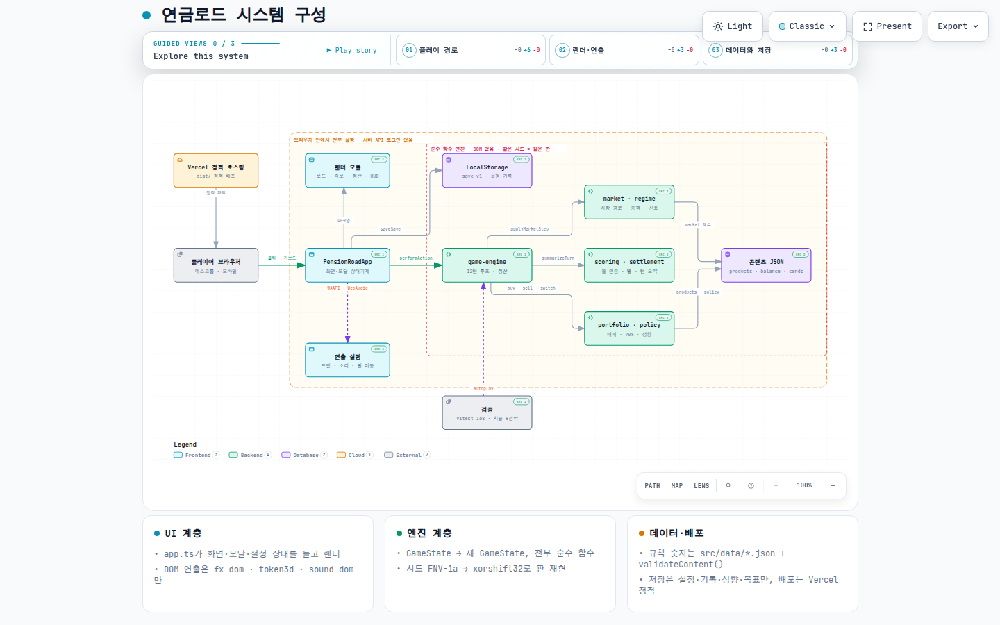
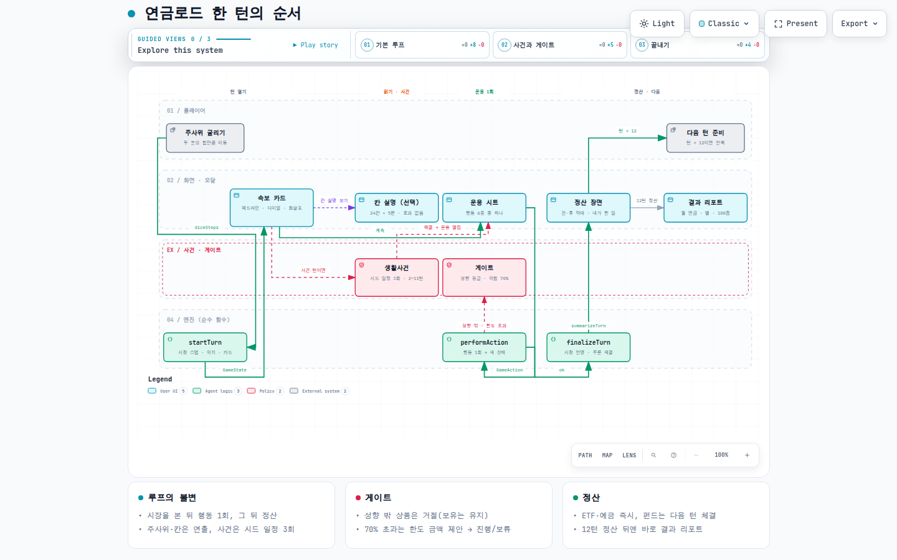
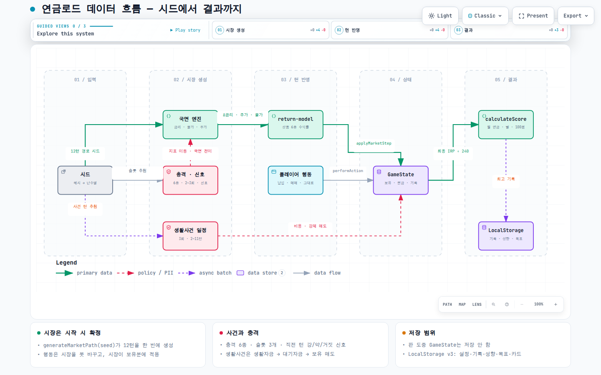
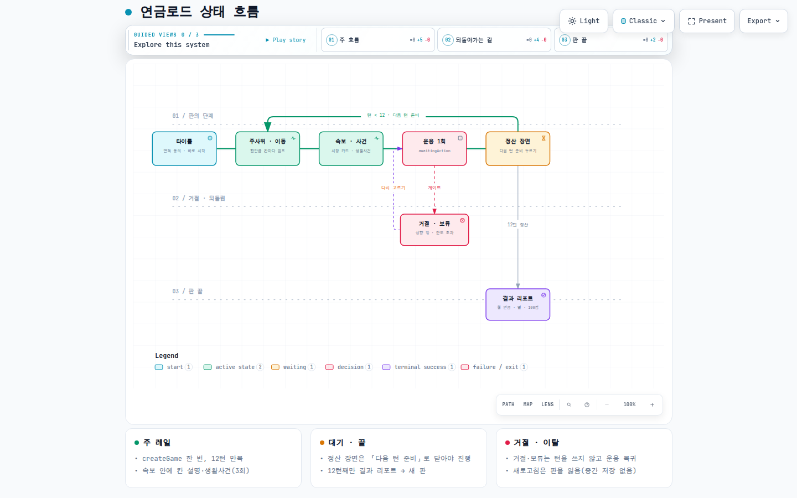
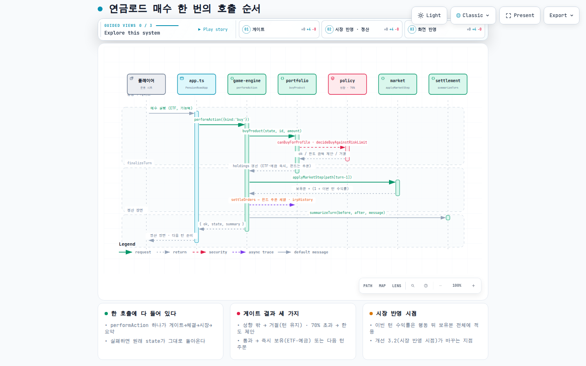

# 연금로드 다이어그램 (archify)

구현 기준 2026-09-06 (`main`, 태그 `prod-2026-09-06-token-3d`). [archify](https://github.com/tt-a1i/archify) 스킬로 만든 다이어그램 5장입니다. 원본은 이 폴더의 JSON, 결과물은 `public/diagrams/*.html`(배포되면 `/diagrams/`에서 열림), 미리보기 PNG는 `preview/`.

| 다이어그램 | 종류 | 원본 | 결과물 | 미리보기 |
|---|---|---|---|---|
| 시스템 구성 | architecture | `architecture.json` | `/diagrams/architecture.html` |  |
| 한 턴의 순서 | workflow | `turn-workflow.json` | `/diagrams/turn-workflow.html` |  |
| 데이터 흐름 — 시드에서 결과까지 | dataflow | `seed-dataflow.json` | `/diagrams/seed-dataflow.html` |  |
| 상태 흐름 | lifecycle | `game-lifecycle.json` | `/diagrams/game-lifecycle.html` |  |
| 매수 한 번의 호출 순서 | sequence | `action-sequence.json` | `/diagrams/action-sequence.html` |  |

## 읽는 법

- 결과물 HTML은 단독 파일입니다. 확대·이동, 노드 검색(`/`), 상·하류 추적, 안내 보기(Guided views), Light/Dark, PNG·SVG 내보내기가 들어 있습니다.
- 뷰어 자체의 버튼 문구(Light, Present, Export, Legend 등)와 `<html lang>`은 영어입니다. archify가 한국어 뷰어 UI를 제공하지 않아 기본값(영어)으로 떨어집니다. 다이어그램 안의 내용은 모두 한국어입니다.
- `architecture.json`은 저장소 증거(`meta.repository` + 각 컴포넌트의 `sources`)를 달고 있어, 뷰어에서 노드를 열면 해당 파일 경로가 보입니다. 리비전은 `main`의 커밋 SHA입니다.

## 검증 결과 (2026-09-06)

다섯 장 모두 `validate --quality showcase`(아티팩트 검사 9개, 구성 오류 0·경고 0), `deliver`(스펙·아티팩트 SHA-256 고정), `visual-check`(실제 Chrome, 1440×900 · 1600×1000 · 1920×1080 · 2048×1320, 라이트·다크, 스크롤 넘침 0, 노드 글자 ≥ 6px)를 통과했습니다. 지각적 검토는 `preview/*.png`(1440×900 라이트)로 사람이 봅니다.

## 다시 만들기

```bash
git clone --depth 1 https://github.com/tt-a1i/archify.git /tmp/archify-skill
cd /tmp/archify-skill/archify
node bin/archify.mjs doctor

# 저장소 증거를 쓰는 architecture는 origin URL이 https://github.com/embrain82/2608_Pension_Monopoly 인 체크아웃이 필요합니다.
# (토큰이 박힌 원격 URL이나 전역 insteadOf 설정이 있으면 GIT_CONFIG_GLOBAL=/dev/null 로 우회)
export GIT_CONFIG_GLOBAL=/dev/null GIT_CONFIG_SYSTEM=/dev/null
node bin/archify.mjs deliver architecture <repo>/docs/diagrams/architecture.json <repo>/public/diagrams/architecture.html --quality showcase --repo-root <repo> --json
node bin/archify.mjs deliver workflow     <repo>/docs/diagrams/turn-workflow.json   <repo>/public/diagrams/turn-workflow.html   --quality showcase --json
node bin/archify.mjs deliver dataflow     <repo>/docs/diagrams/seed-dataflow.json   <repo>/public/diagrams/seed-dataflow.html   --quality showcase --json
node bin/archify.mjs deliver lifecycle    <repo>/docs/diagrams/game-lifecycle.json  <repo>/public/diagrams/game-lifecycle.html  --quality showcase --json
node bin/archify.mjs deliver sequence     <repo>/docs/diagrams/action-sequence.json <repo>/public/diagrams/action-sequence.html --quality showcase --json

# 브라우저 증거(스크린샷 사이드카가 같은 폴더에 생기므로 확인 뒤 지우거나 preview/로 옮김)
node bin/archify.mjs visual-check <repo>/public/diagrams/architecture.html --json
```

`architecture.json`의 `meta.repository.revision`은 다이어그램이 설명하는 `main` 커밋으로 갱신합니다(`git rev-parse main`).

## 바꿀 때 지킬 것

- 노드는 12개 이하, 주 경로 하나. 라벨은 코드 식별자(`performAction`, `applyMarketStep`)를 그대로 쓰고 설명은 한국어.
- 글자 크기 검사(1440px 화면에서 6px 이상) 때문에 sublabel은 짧게(한글 10자 안팎), viewBox 너비는 1100 이하.
- 다섯 장의 카드 문구는 한 줄(≈26자) 이하로 유지해야 1440×900에서 세로 넘침이 없습니다.
- 개선 3.2(시장 반영 시점)를 구현하면 `action-sequence.json`과 `turn-workflow.json`의 finalizeTurn 순서를 먼저 고칩니다.
